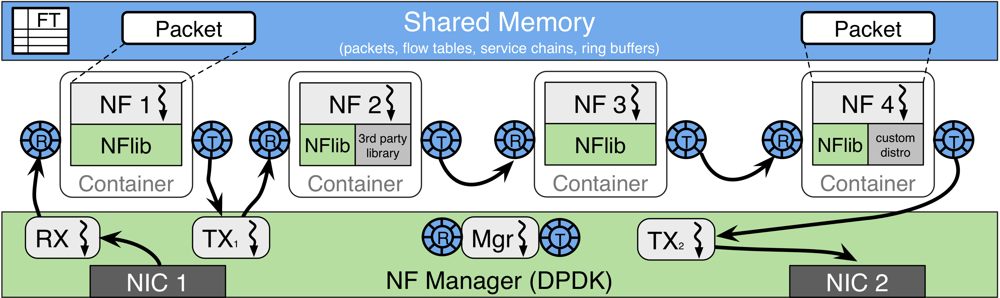

## Introduction
This directory contains our explorative experiments of the state-of-the-art OpenNetVM (ONVM) [platform on a commodity off-the-shelf server. Our experiments focus on the performance diagnoses of ONVM. Please refer to the [main website]((https://github.com/sdnfv/openNetVM)) for further information. The general architecture of ONVM is illustrated below: 

The experiments include 3 different Service Function Chaining (SFC) configurations, namely:

1. Linear 
2. DAG 
3. DAG-2

We conduct three types of experiments:

1. Load stimulus: Perturbing the input traffic with different input rates and patterns. 

2. Resource stimulus: Perturbing the allocated resource to individual VNFs. Currently, we assign collocated parasite processes to each VNF to perturb its CPU share.

3. The combination of the previous two experiments. 

Please refer to each SFC directory for data and further details. 

## How to interpret the data 

### CSV files for each experiment 

#### Files that are presented in all experiments: 
* __tx_stats__: Statistics for the input traffic. The input traffic was generated and recorded using the [MoonGen](https://github.com/emmericp/MoonGen.git) traffic generator. The generated synthetic packets follow either pure 128 B or the Internet IMIX distribution (i.e., 64B: 512B: 1024B = 7:4:1). Please refer to the *tx_stats.csv* file in each directory to check the packet size distribution. Normally, the packet rate of IMIX is less than 4 Mpps (i.e., million packets per second). A sample tx_stats record is illustrated below. 
  
| Time | Device | Direction | PacketRate | Mbit | MbitWithFraming | TotalPackets | TotalBytes |
|------|--------|-----------|------------|------|-----------------|--------------|------------|
|  1686141358 |	Device: id=0 |	TX	| 0.33343282345416 |	943.37429415621 |	996.72354590888	| 339888 |	120205980 |

* __rx_stats__: Statistics for the end-to-end throughput.
* __latency__: Statistics for the end-to-end latency. 

#### Files that are specific to the ONVM platform
* __nf_out__: 

> The column names:
> nfs[i].tag, nfs[i].instance_id, nfs[i].service_id, nfs[i].thread_info.core, rx_pps, tx_pps, rx, tx, act_out, act_tonf, act_drop, nfs[i].thread_info.parent, state, rte_atomic16_read(&nfs[i].thread_info.children_cnt), rx_drop_rate, tx_drop_rate, rx_drop, tx_drop, act_next, act_buffer, act_returned 
